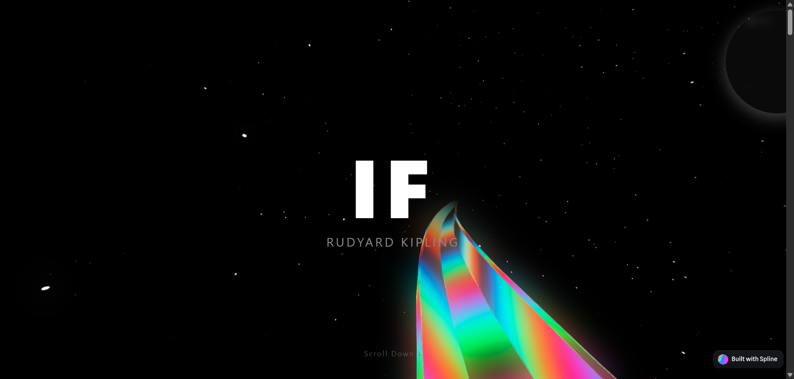

## This is my attempt to try to create those awesome 3d websites using spline 3d models
well plan scraped and is put on hiatus i guess. i am having some trouble and a bit of frustration over this here. it didnt really turn out the way i hoped but i made it workable with a little help. i even forgot to commit it on time so that i could go back now the code seems too big (it isnt i'm too lazy) to change anything especially when the exams are coming in relaly close i think i'll keep this project here and do some small projects to get the certificate and focus on ym studies and ill focus fully after exams.

## here is the previedw:

